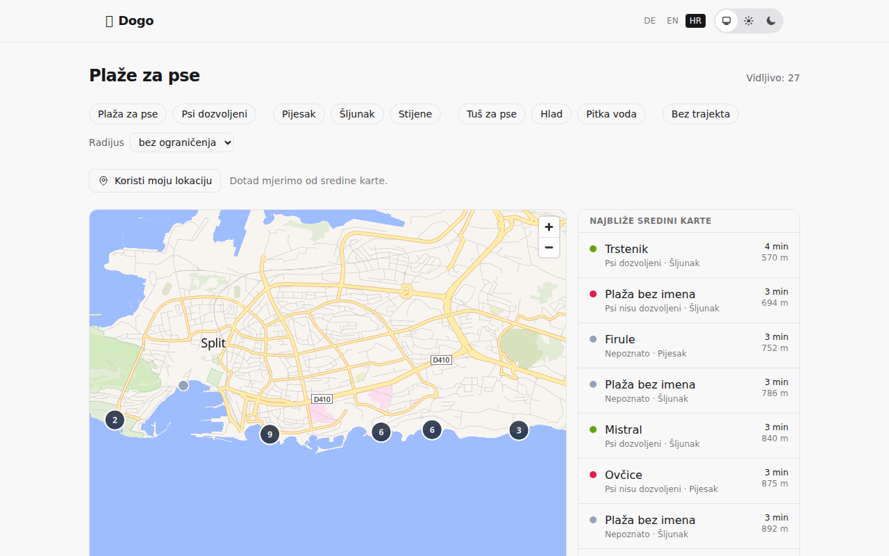
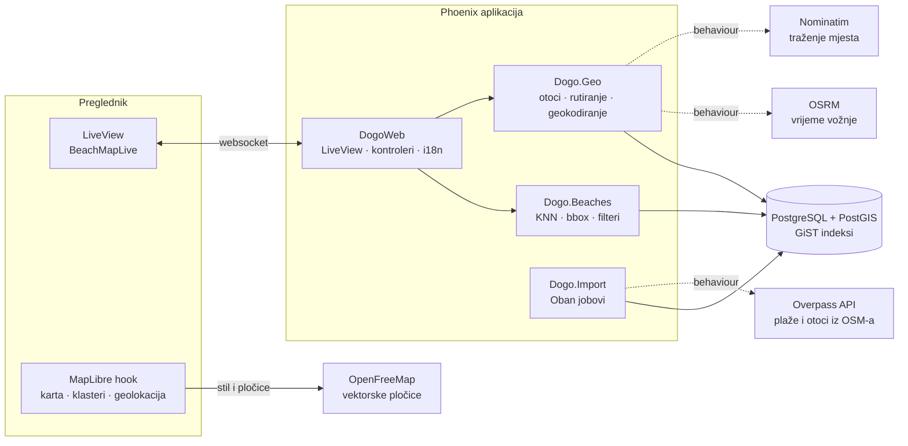

# Dogo 🐕🏖️

[](https://github.com/CHANGE-ME/dogo/actions/workflows/ci.yml)

**Dogo vlasniku psa na hrvatskom Jadranu pokazuje najbliže plaže na kojima smije
biti sa psom — s pravim vremenom vožnje i upozorenjem kad je plaža "preko mora".**

**Demo:** _(uskoro)_ · **Plan izrade:** [`docs/PLAN.md`](docs/PLAN.md)



> **Disclaimer:** Podaci su demonstracijski. Lokacije plaža potječu iz
> OpenStreetMapa (© OpenStreetMap contributors, ODbL). Atributi vezani uz pse
> djelomično su generirani i ne odražavaju stvarna pravila.

## Tehnički zanimljivo

- **Prostorni upiti u PostGIS-u** — KNN pretraga (`ORDER BY geom <-> point`) uz
  GiST indeks, udaljenosti na `geography` tipu. Izmjereni učinak indeksa u
  [`docs/performance.md`](docs/performance.md).
- **Problem otoka** — zračna udaljenost na Jadranu vara; poligoni otoka iz OSM-a
  služe za oznaku "preko mora" i filter "bez trajekta"
  ([ADR 0005](docs/adr/0005-poligoni-otoka-iz-osm-a.md)).
- **Asinkroni OSRM** — lista se prikaže odmah sa zračnom udaljenošću, vrijeme
  vožnje stiže naknadno; timeout i fallback ne ruše stranicu
  ([ADR 0008](docs/adr/0008-osrm-kao-neobavezan-dodatak.md)).
- **Idempotentan uvoz** — Oban job s upsertom po `osm_id`; ponovno pokretanje ne
  stvara duplikate.

## Arhitektura



Web sloj ne piše Ecto upite; sve ide kroz kontekste. Svaki vanjski servis je iza
behaviour modula, pa ga testovi zamjenjuju Moxom i nikad ne idu na mrežu.
Zašto LiveView, a ne SPA: [ADR 0006](docs/adr/0006-liveview-umjesto-spa.md).
Zašto OSM i što mu nedostaje: [ADR 0007](docs/adr/0007-openstreetmap-kao-izvor-podataka.md).

## Lokalno pokretanje

Potreban je PostgreSQL **s PostGIS ekstenzijom**. Najlakše preko Dockera:

```sh
docker compose up -d     # PostgreSQL 16 + PostGIS na portu 5432
mix setup                # deps, baza, migracije, assets
mix beaches.import       # plaže s Overpassa (stavlja job u red)
mix islands.import       # poligoni otoka, za oznaku "preko mora"
mix phx.server           # http://localhost:4000 — Oban tada izvrši uvoz
```

Uvoz traje minutu-dvije i ovisi o javnom Overpass API-ju; ako padne, ponovno
pokretanje je sigurno.

Bez Dockera: instaliraj `postgresql-16-postgis-3` i postavi varijable `PGHOST`,
`PGPORT`, `PGUSER`, `PGPASSWORD` prema svojoj instalaciji.

## Stack

Elixir · Phoenix LiveView · PostgreSQL + PostGIS · Oban · MapLibre GL JS ·
Gettext (hr/en/de) · PWA · Fly.io

## Provjere kvalitete

```sh
mix precommit          # compile --warnings-as-errors, deps.unlock, format, credo, test
mix dialyzer
mix coveralls.html     # pokrivenost, izvještaj u cover/; CI pada ispod 80 %
```

Pokrivenost: **90 %** za domenu (`lib/dogo`), 83 % ukupno. Prostorni upiti
testiraju se na stvarnoj PostGIS bazi; Overpass, Nominatim i OSRM su iza
behavioura i u testovima nikad ne idu na mrežu.

## Produkcija

Deploy na Fly.io, upute u [`fly.toml`](fly.toml). LiveDashboard je na
`/admin/dashboard`, iza basic autha (`DASHBOARD_USER`, `DASHBOARD_PASSWORD`);
bez tih varijabli ruta vraća 404. Uz standardne metrike Phoenixa, Ecta i VM-a
prikazuje trajanje prostornih upita, pozive Overpassu, Nominatimu i OSRM-u po
ishodu te trajanje uvoza — bez koordinata u metapodacima.

## Dokumentacija

- [`docs/PLAN.md`](docs/PLAN.md) — vizija, opseg, epici i storyji
- [`docs/adr/`](docs/adr/) — arhitektonske odluke
- [`docs/performance.md`](docs/performance.md) — mjerenja indeksa i Lighthouse
- [`AGENTS.md`](AGENTS.md) / [`CLAUDE.md`](CLAUDE.md) — konvencije za rad s AI alatima

## Licenca podataka

Podaci o plažama: © OpenStreetMap contributors, [ODbL](https://www.openstreetmap.org/copyright).
Pločice karte: [OpenFreeMap](https://openfreemap.org), © OpenMapTiles, podaci © OpenStreetMap contributors.
